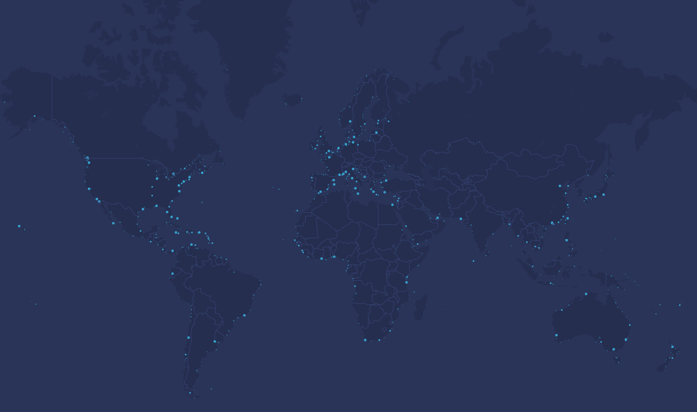
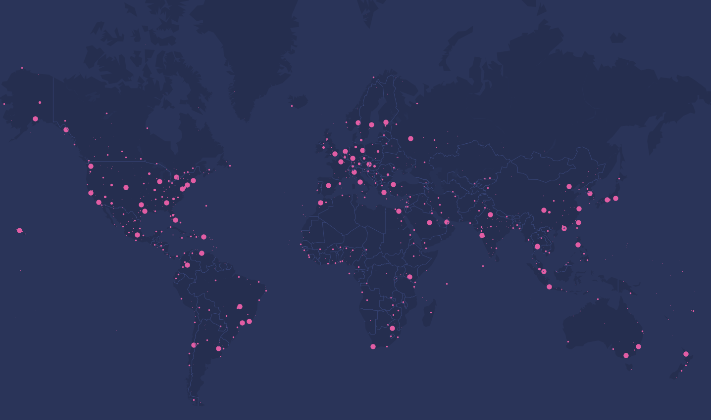

 
<div align="center">
 
 <h1 align="center">  MapX </h1>
 
  <a href="https://github.com/AndersGroengaard/mapx/issues/new?assignees=&labels=bug&template=01_BUG_REPORT.md&title=bug%3A+">Report a Bug</a>
  ·
  <a href="https://github.com/AndersGroengaard/mapx/issues/new?assignees=&labels=enhancement&template=02_FEATURE_REQUEST.md&title=feat%3A+">Request a Feature</a>
  .
  <a href="https://github.com/AndersGroengaard/mapx/discussions">Ask a Question</a>
</div>

<br/>


<div align="center">

[]()
[]()
[](https://www.gnu.org/licenses/gpl-3.0)
 
 
 <br/>
<i> A repository for containing python code for creating various map plots </i>
 
</div>


## Examples

For example, to plot all the worlds harbors/ports:
```python
from mapplot import MapPlot

mymap = MapPlot(style="cyberpunk")
mymap.show_ports()
 
```


<div align="center">

</div>

Or to plot all the worlds airports:

```python
from mapplot import MapPlot

mymap = MapPlot(style="cyberpunk")
mymap.show_airports()
 
```

<div align="center">

</div>
