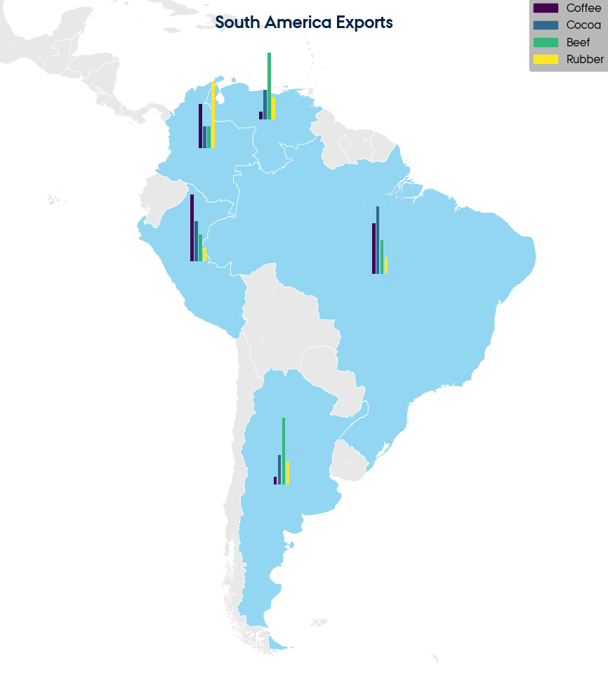
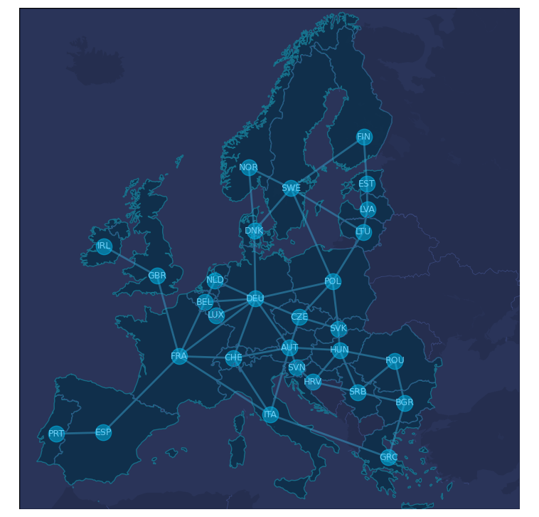

 
<div align="center">

 <br/> 
 
 <h1 align="center">  MapZ </h1>
 
 <br/> 
 
 
  <a href="https://github.com/AndersGroengaard/mapx/issues/new?assignees=&labels=bug&template=01_BUG_REPORT.md&title=bug%3A+">Report a Bug</a>
  ·
  <a href="https://github.com/AndersGroengaard/mapx/issues/new?assignees=&labels=enhancement&template=02_FEATURE_REQUEST.md&title=feat%3A+">Request a Feature</a>
  .
  <a href="https://github.com/AndersGroengaard/mapx/discussions">Ask a Question</a>
</div>

<br/>


<div align="center">

[]()
[]()
[](https://www.gnu.org/licenses/gpl-3.0)


 
 
 
 
 
 
 
 
 
 <br/>
<i> A repository for containing python code for creating various map plots </i>
 
</div>

<br/><br/>

## Examples

For example, to plot all the worlds harbors/ports:
```python
from mapplot import MapPlot

mymap = MapPlot(style="cyberpunk")
mymap.show_ports()
 
```


<div align="center">

</div>


<br/><br/>

Or to plot all the worlds airports:

```python
from mapplot import MapPlot

mymap = MapPlot(style="cyberpunk")
mymap.show_airports()
 
```

<div align="center">

</div>


<br/><br/>

Or to plot all the worlds urban areas on a dark theme and save the image as a png in the "saved_plots" folder:

```python
from mapplot import MapPlot

mymap = MapPlot(place="Europe", style="dark")
mymap.show_urban_areas()
mymap.save("urban")
 
```

<div align="center">

</div>


<br/><br/>


### Plots with diagrams

To plot bar plots on each country (Here with some made up data for some South American countries):

```python
from mapplot import MapPlot
import pandas as pd

mydict = {"BRA": {"Coffee": 3, "Cocoa":4, "Beef":2, "Rubber":1},
          "COL": {"Coffee": 2, "Cocoa":1, "Beef":1, "Rubber":3},
          "PER": {"Coffee": 5, "Cocoa":3, "Beef":2, "Rubber":1},
          "ARG": {"Coffee": 1, "Cocoa":4, "Beef":9, "Rubber":3},
          "VEN": {"Coffee": 1, "Cocoa":4, "Beef":9, "Rubber":3}
          }

df = pd.DataFrame.from_dict(mydict)
mymap = MapPlot(place="South America", style="light", title="South America Exports")
mymap.highlight_countries(country_codes=list(df.columns))    
mymap.add_bar_plots(dataframe=df, width=0.25)
mymap.save()
```

<div align="center">

</div>

### Plots with networks


To add a network plot to the map, call the "add_country_network()" method from the MapPlot class.
The may be defined from various ways, for example from a list of tuples:

```python
    mymap = MapPlot(place="Europe", style="cyberpunk")
    
    country_links = [("DEU", "FRA"), ("FRA", "ESP"), ("DEU", "DNK"),
                     ("DNK", "SWE"), ("DNK", "NOR"), ("DEU", "POL"),
                     ("NOR", "SWE"), ("POL", "LTU"), ("LTU", "LVA"),
                     ("LVA", "EST"), ("EST", "FIN"), ("SWE", "FIN"),
                     ("DEU", "CZE"), ("POL", "CZE"), ("DEU", "AUT"),
                     ("AUT", "CZE"), ("ESP", "PRT"), ("CZE", "SVK"),
                     ("HUN", "AUT"), ("GBR", "IRL"), ("FRA", "BEL"),
                     ("NLD", "BEL"), ("NLD", "DEU"), ("BEL", "DEU"),
                     ("LUX", "DEU"), ("CHE", "DEU"), ("CHE", "FRA"),
                     ("CHE", "AUT"), ("CHE", "ITA"), ("FRA", "ITA"),
                     ("AUT", "ITA"), ("AUT", "SVN"), ("HRV", "SVN"),
                     ("HRV", "SRB"), ("GRC", "ITA"), ("HUN", "ROU"),
                     ("HRV", "HUN"), ("BGR", "ROU"), ("SRB", "ROU"),
                     ("SRB", "BGR"), ("BGR", "GRC"), ("POL", "SVK"),
                     ("HUN", "SVK"), ("HUN", "SRB"), ("POL", "SWE"),
                     ("SWE", "LTU"), ("FRA", "GBR")]   
    
    mymap.add_country_network(link_values=country_links)
```

<div align="center">

</div>


### Combined Plots


Another example, could be combining a map plot with a networks plot, and also pie plots for each country. See for the following example with some made up data for finnish metal "exports":


```python
from mapplot import MapPlot
import pandas as pd

mydict = {"DEU": {"Metal": 3, "Death Metal":4, "Black Metal":2, "Folk Metal":1},
          "POL": {"Metal": 2, "Death Metal":1, "Black Metal":1, "Folk Metal":3},
          "DNK": {"Metal": 5, "Death Metal":3, "Black Metal":2, "Folk Metal":1},
          "NOR": {"Metal": 1, "Death Metal":4, "Black Metal":9, "Folk Metal":3},
          "ISL": {"Metal": 1, "Death Metal":4, "Black Metal":4, "Folk Metal":8}
          }

df = pd.DataFrame.from_dict(mydict)
mymap = MapPlot(place="Europe", style="cyberpunk", title="Finnish Metal Music Export")
mymap.add_country_network(country="FIN", dataframe=df, directed=True)
mymap.add_pie_charts(dataframe=df)
mymap.save()
 
```

From which you should be able to produce the following plot:

<div align="center">

</div>

You should be able to replacate this example with any data you like and for any countries you would like, as long as you follow the dataframe structure in the example.


<br/><br/>

## Notes

Available regions that you can specify in the the "place" parameter when calling "MapPlot" are:
- Africa
- Asia
- Eurasia
- Europe
- North America
- South America
- Middle East
- Norway
- Sweden
- Denmark

I can add more if anyone requests them.


Available styles that you can specify under the "style" parameter when calling "MapPlot", in the time of writing are:
- light
- dark
- cyberpunk

Some of the geometric country centroids that define the placement of country network nodes have been manually edited for aesthetic reasons (for example, the geometric centroid of Norway is inside Sweden, or the geometric centroid of Portugal is in the Atlantic Ocean) or to better represent the population density (For example, Swedens and Great Britain's node has been moved south). The centroids that have been edited are:
- Norway
- Sweden
- Portugal
- Great Britain
- Finland
- USA

## Acknowledgements


Country shapefiles obtained from: https://public.opendatasoft.com/explore/dataset/world-administrative-boundaries/export/

Shapefiles for airports, ports and urban areas were obtained from: https://www.naturalearthdata.com/downloads/
